# Práctica Transforming Data and Testing Continuously

- Autor: Alien Embarec Riadi

- Asignatura: Procesadores de Lenguajes

- 3º curso del Grado en Ingeniería Informática, itinerario de Computación. Universidad de la Laguna

- Curso: 2019/2020

## Acceso a BULL PuntoQ

Repositorio de fuentes bibliográficas, libros y trabajos.

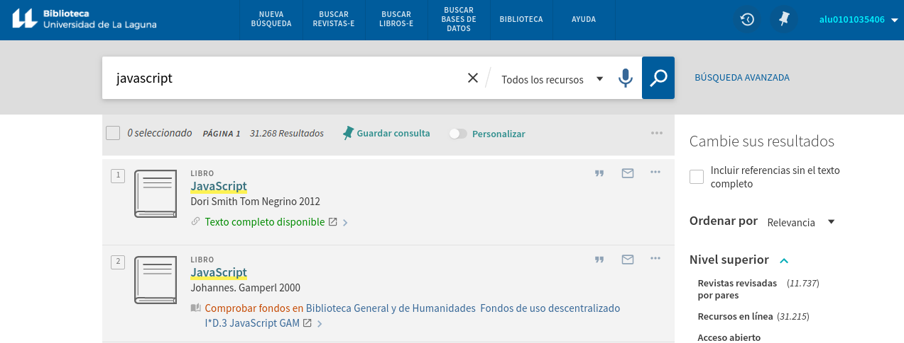

## Resumen capítulo 5 Transforming Data and Testing Continuously

El objetivo de este capítulo es explicar la transformación de datos externos a nuestra aplicación, que pueden estar en XML, en un formato ampliamente usado en las base de datos de hoy en día, Javascript Object Notation (JSON).

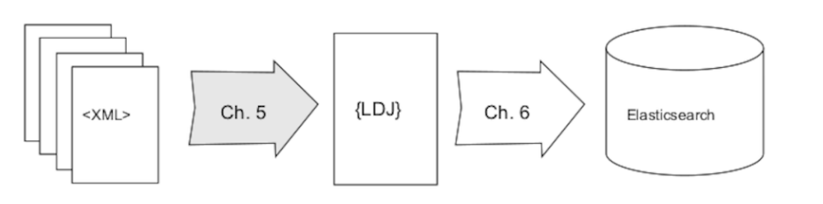

El proceso explicado a grandes rasgos, consiste en convertir el XML a Line Delimited JSON (LDJ), y posteriormente a JSON.

### Procuring External Data

Los datos que se van a transformar provienen del proyecto Gutenberg [^1]. Y contienen 53000 ficheros de libros.

Los datos están en formato RDF, Resource Description Framework, un subformato de XML. Se importarán en un fichero comprimido `bz2`. Este formato muestra un mayor porcentaje de compresión que los métodos tradicionales [^2], puesto que reduce bastante el tamaño del fichero original.

El objetivo, como se ha mencionado, es transformar los datos de XML a JSON, porque este último es el formato estándar que adoptan las bases de datos y las aplicaciones en el intercambio de información entre cliente y servidor.

Para comenzar la tansformación, creamos dos ficheros en nuestra máquina:

```bash
​$ ​​mkdir​​ ​​databases​
​$ ​​mkdir​​ ​​data
```

El directorio `databases` va a contener los programas implementados para la transformación, y el esquema de la propia base de datos.

El directorio `data` va a contener los datos con los que se trabajará.

Para importar los datos, ejecutamos `​​curl​​ ​​-O​​ ​​http://www.gutenberg.org/cache/epub/feeds/rdf-files.tar.bz2`.

`curl` es un comando que nos permite transferir datos con el protocolo http.

Luego, para descomprimir el fichero se ejecuta:

```bash
$ ​​tar​​ ​​-xvjf​​ ​​rdf-files.tar.bz2
```

Se le pasa una serie de opciones como son `v`, para mostrar información de los ficheros procesado. `j` filtra el archivo a través de un método de descompresión `bzip2`.
[^1]: https://www.gutenberg.org/
[^2]: https://www.gutenberg.org/

Dentro de `data/cache`, cada fichero está en un directorio único, tanto el fichero como el directorio llevan el id que les asigna el proyecto Gutenberg.

### Transformando los datos

El formato de los ficheros tiene la siguiente apariencia:

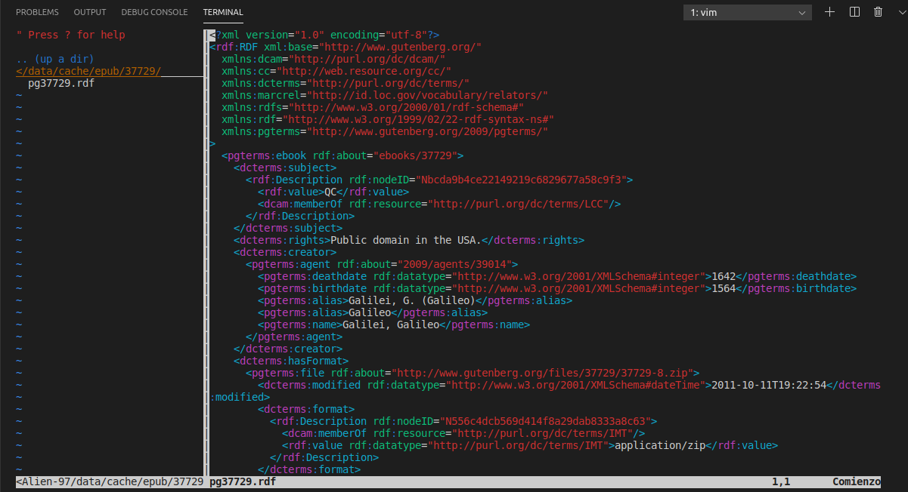

Nos interesa transformar concretamente el fichero `cache/epub/132/pg132.rdf`. Que tiene el siguiente formato en RDF:

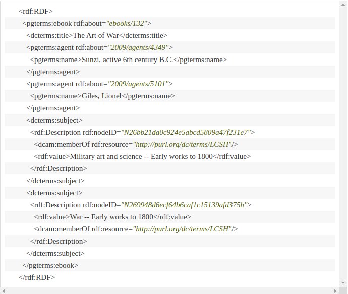

Vemos que usa notación `Doublin Core`, en los `dcterms`, que es una guía de estilo de escritura de metadatos XML.

Dentro de las etiquetas XML, vemos que se usa la notación `subject-object-predicate` característica de RDF/XML.

Por ejemplo, vemos el uso de `rdf:about` para definir la ruta al subject, el libro `ebooks/132`.

La información que se quiere extraer es:

- The Gutenberg ID (132)
- El título del libro
- La lista de autores (cada uno definido en una etiqueta `agents`)
- La lista de sujetos, esto es, los temas de que trata el libro

El objetivo es convertir esta sintaxis particular a JSON, de tal manera que nos quede un objeto JSON con esta estructura:

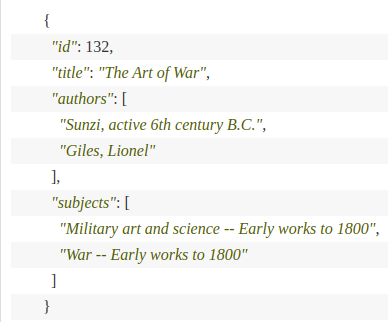

### El código y las pruebas

El primer paso para lograr esto es hacer un parsing del contenido RDF. Aprovecharemos este paso para poner en práctica el `Behavioural Driven Development`, con las librerías `Mocha` y `Chai`, que hace que la escritura del código de la prueba se asemeje a la del lenguaje humano.

Además, el BDD se usa en un contexto donde primero se escribe la prueba y luego el código que la valida. Esto puede no ser tan trivial ya que muchas veces no se conoce la salida esperada del código. En el ámbito en el que queremos usarlo, las librerías citadas son muy adecuadas para el procesado de datos, ya que conocemos bien la salida esperada, y podemos especificarla en las pruebas.

Mocha nos permite definir bloques de expectativas, que después veremos, y Chai se especializa en las afirmaciones o `assertions`.

Chai tiene tres métodos principales para las pruebas: `expect` , `assert` and `should`. El que permite una sintaxis más fácilmente leible es `expect`, más adelante profundizaremos en él.

Para comenzar con el código y las pruebas asociadas, es conveniente hacer `npm init -y` para inicializar el directorio `npm`, tener un `package.json` con las dependencias locales, poder configurar las pruebas etc.

Situémonos en el directorio `databases`.

Instalamos mocha y chai con `npm install --save-dev --save-exact mocha@2.4.5 chai@3.5.0`. El `flag` `--save-dev` es importante ponerlo porque le indicamos a `npm` que el paquete lo queremos únicamente para el desarrollo de la app, cuando este desplegada y los usuarios la descarguen, con `--save-dev` activado, los paquetes que usamos para testear no van a aparecer en las dependencias del usuario.

En el `package.json`, modificamos el atributo `test`, para que cuando sea invocado ejecute las pruebas con la librería `mocha`.

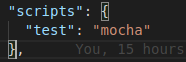

Resultado ejecución de una prueba con `npm test`.

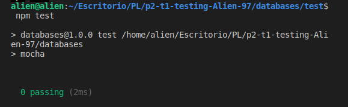

Al escribir la prueba primero, vemos que como es esperado, esta va a fallar:

```javascript
'use strict'; // modo estricto en JS, no se
// puede definir asignar un valor a una variable
// no definida etc...

const fs = require('fs'); // libreria para lectura por fichero
const expect = require('chai').expect; // require del
//modulo expect de la librería chai

const rdf = fs.readFileSync(`../data/cache/epub/132/pg132.rdf`); // la ruta al fichero que vamos a parsear

describe('parseRDF', () => {
  //Bloque de expectativas
  it('should be a function', () => {
    //Expectativa
    expect(parseRDF).to.be.a('function');
    // esperamos que parseRDF sea una funcion
  });
});
```

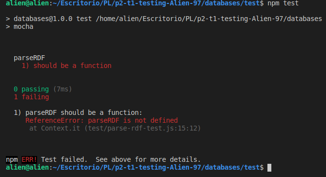

Ahora el siguiente paso es escribir el código que parsea el RDF, y que nos va a permitir pasar la prueba. La idea es que sea un módulo que se pueda exportar para su uso en otros proyectos o por otros usuarios.

Escribimos la mínima cantidad de código que nos hace pasar la prueba y después refactorizamos.

Este es el código escrito:

```javascript
module.exports = (rdf) => {};
```

Y luego lo incluimos en el fichero de pruebas como:

```javascript
const​ parseRDF = require(​'../lib/parse-rdf.js'​); // invocando modulo parseRDF
```

La prueba funciona porque solo comprobamos que el módulo sea una función anónima, y lo es:

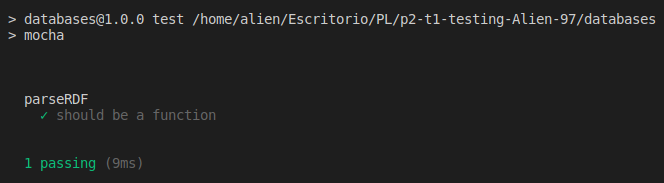

### Refactorizando el código

Añadimos una segunda expectativa, queremos que la función devuelva algo que no sea `undefined`

```javascript
it('should parse RDF content', () => {
  const book = parseRDF(rdf);
  expect(book).to.be.an('object');
});
```

La prueba falla, ahora escribimos el mínimo código para hacer que funcione: creamos el objeto JS que va a contener el JSON del libro, y lo devolvemos.

```javascript
module.exports = (rdf) => {
  const book = {};
  return book;
};
```

Ahora ejecutamos el `npm test`, y funciona:

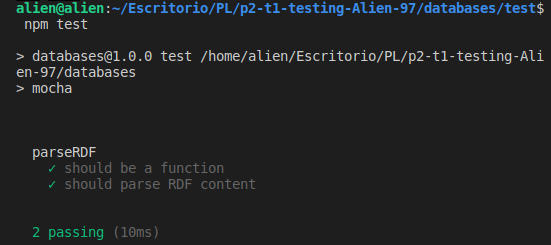

Este será el flujo de trabajo con el BDD, que se puede esquematizar de la siguiente manera:

1. Añadir una prueba nueva
2. Ejecutar la prueba y ver que falla
3. Modificar el código asociado a la prueba fallida
4. Ejecutar de nuevo el test y ver que funciona

Añadimos un watcher que nos va a ejecutar el paso 2 y 4 automáticamente. En el `package.json`, en el objeto `scripts` añadimos:

`"test:watch": "mocha --watch --reporter min"`

Con la opción `--reporter min`, mocha va a limpiar la pantalla y mostrará información mínima cuando las pruebas funcionen, cuando fallen mostrará la información completa.

Lo que hace watch es monitorizar los cambios que ocurren en los ficheros `.js`. Con cada cambio ejecuta las pruebas. Esto es muy similar a la herramienta `Guardfile` de Ruby.

### Parsing del fichero

La librería que se va a usar para el parsing es `Cheerio`, el RDF/XML usa una notación _subject-predicate-object_ representando los datos de manera separada, y convertirlo directamente a JSON es complicado, porque este última representa los datos de una forma más jerárquica y en un solo objeto Hash o Array.

Instalamos Cheerio,ejecutamos:

`​​npm​​ ​​install​​ ​​--save​​ ​​--save-exact​​ cheerio@0.22.0`

Ahora hagamos otra prueba, comprobar que el libre tiene un id. La prueba falla:

```javascript
it('should parse RDF content', () => {
  const book = parseRDF(rdf);
  expect(book).to.be.an('object');
  expect(book).to.have.a.property('id', 132);
});
```

Ahora escribimos el código que hace pasar la prueba. Y funciona

Ahora, añadamos otra prueba para comprobar el título del libro. Inicialmente falla y después funciona.

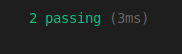

Ahora añadamos otra prueba para comprobar el array de autores del libro. Queremos comprobar que este sea un array, de longitud 2, y que contenga las cadenas con los nombres de los autores.

```javascript
expect(book)
  .to.have.a.property('authors')
  .that.is.an('array')
  .with.lengthOf(2)
  .and.contains('Sunzi, active 6th century B.C.')
  .and.contains('Giles,Lionel');
```


Ahora, después de añadir los métodos de Cheerio adecuados, funciona.

Ahora nos queda un solo elemento por encontrar, la lista de temas que trata el libro. Añadimos una prueba
